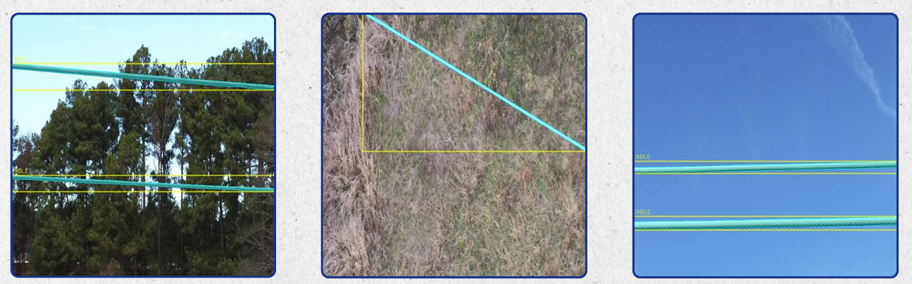
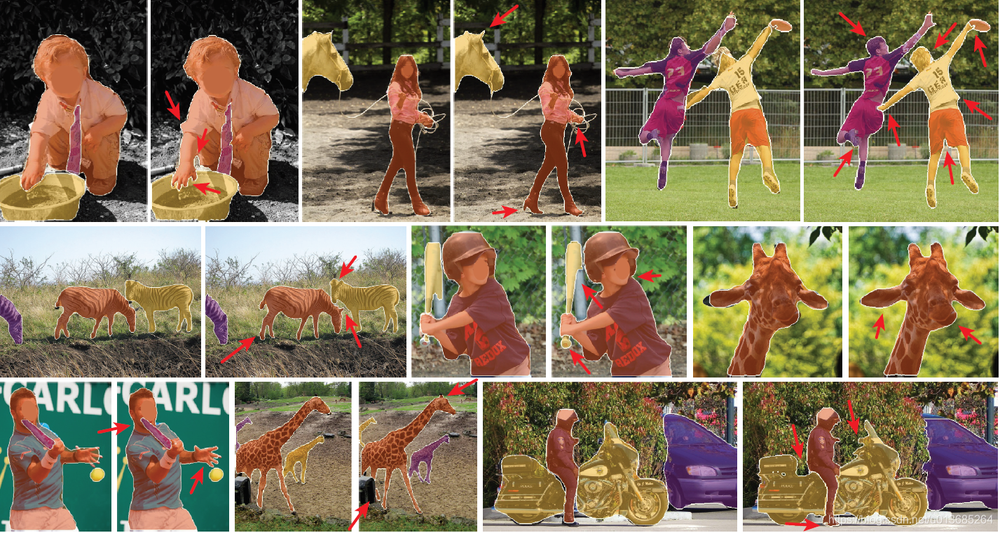
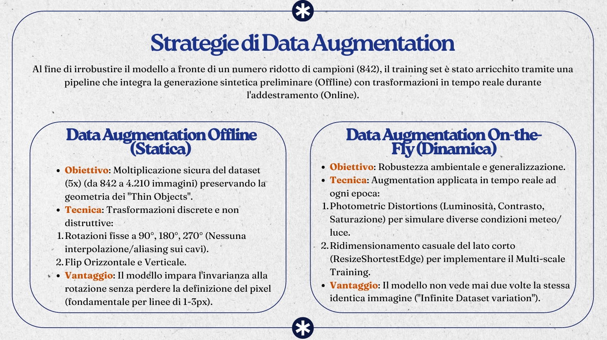

# Aerial Power Line Detection & Segmentation using PointRend

> **Course Project:** Computer Vision (M.Sc. Computer Engineering, Unical) 
> **Authors:** Anastasia Martucci & Giuseppe Zappia 

## 📂 Repository Contents
* `progetto-cv-martucci-271316-zappia-268784.ipynb`: The complete training and inference pipeline, including data augmentation, custom loss implementation, and evaluation logic.
* `PRESENTAZIONE_MARTUCCI_ZAPPIA.pdf`: Project presentation slides detailing the theoretical background, architectural choices, and experimental results.

---

## 📌 Project Overview
This project addresses the challenging task of **detecting and segmenting power lines (cables)** in aerial images captured by UAVs, based on the **TTPLA dataset**.

Power lines are "thin objects" (often 1-3 pixels wide) set against cluttered backgrounds (vegetation, urban areas). Traditional segmentation architectures often fail to preserve the continuity of these lines due to aggressive downsampling.

**Our Solution:** We implemented a custom **Instance Segmentation** pipeline based on **Detectron2** and **PointRend**, enhanced with a hybrid loss function and a geometric post-processing strategy to recover pixel-perfect details.

*(Example of model output: The model successfully segments thin wires against complex backgrounds)*

---

## 🧠 The Challenge: The "Thin Object" Problem

Standard segmentation networks (like Mask R-CNN) project features onto a fixed low-resolution grid (e.g., $28 \times 28$).
* **The Issue:** For a cable that is 1 pixel wide, this projection mixes the cable features with the background, causing the signal to "vanish" or become fragmented.
* **Our Approach (PointRend):** We utilized **Point-based Rendering**. Instead of predicting all pixels on a fixed grid, the model iteratively selects the most "uncertain" points (the edges) and re-computes their features using high-resolution maps from the FPN (Feature Pyramid Network).

---

## 🛠️ Methodology & Architecture

### 1. Full Pipeline Architecture
The model extends the Mask R-CNN framework by replacing the standard mask head with a **PointRend** module. This allows for high-resolution segmentation without the computational cost of processing a fine grid over the entire image.

*(Complete pipeline: ResNet-50+FPN Backbone feeding into the PointRend Head for refined segmentation)*

### 2. Model Configuration
* **Backbone:** ResNet-50 with Feature Pyramid Network (FPN) for multi-scale feature extraction.
* **PointRend Head:** Iteratively refines the segmentation boundaries by selecting the most uncertain points from the coarse prediction.
* **Training Schedule:** 3x Schedule (~45k iterations) to ensure optimal convergence.

### 3. Hybrid Loss Function
Given the extreme class imbalance (cables represent <1% of pixels), a standard loss function would fail. We implemented a custom hybrid loss:

$$L_{total} = 5 \cdot L_{focal} + L_{dice}$$

* **Focal Loss:** Focuses the network on "hard" examples (the thin cables), down-weighting the easy background.
* **Dice Loss:** Optimizes the global overlap (IoU), ensuring the predicted lines are continuous rather than fragmented.

### 4. Data Augmentation Strategy
To handle the limited dataset size (842 training images), we designed a two-stage augmentation pipeline:
* **Offline (Static):** Geometric transformations (Rotation 90°/180°, Flips) to expand the dataset 5x without introducing interpolation artifacts on the thin lines.
* **Online (On-the-fly):** Photometric distortions (brightness, contrast) and Multi-scale training applied during each epoch.

---

## 📐 Geometric Post-Processing

The task required outputting not just the mask, but the polar coordinates $(\rho, \theta)$ of the lines.

1.  **Bias Correction:** We identified a systematic geometric shift. We applied a systematic correction of `(+1px, +1px)` to all predictions, maximizing the Intersection over Union (IoU).
2.  **Line Regression:** We utilized `cv2.fitLine` (L2 Distance) on the segmented pixels to extract the precise angle and distance of the cables.

---

## 📊 Results

The model was evaluated using the **Line Detection Score (LDS)**, which combines segmentation quality (mAP, mAR) with geometric angular precision.

* **LDS Score Achieved:** **2.54**.
* **Observations:** The high score confirms that the predicted lines are not only visually close but geometrically faithful to the physical cables, with high angular precision.

---

## 👥 Authors

* **Anastasia Martucci** - [GitHub Profile](https://github.com/GiuseppeZappia)
* **Giuseppe Zappia** - [GitHub Profile](https://github.com/ananaaspelirroja)

---

## 📄 References
* [Detectron2 Library](https://github.com/facebookresearch/detectron2)
* [TTPLA Dataset](https://github.com/R3ab/ttpla_dataset)
* Original Presentation and Code included in this repository.
